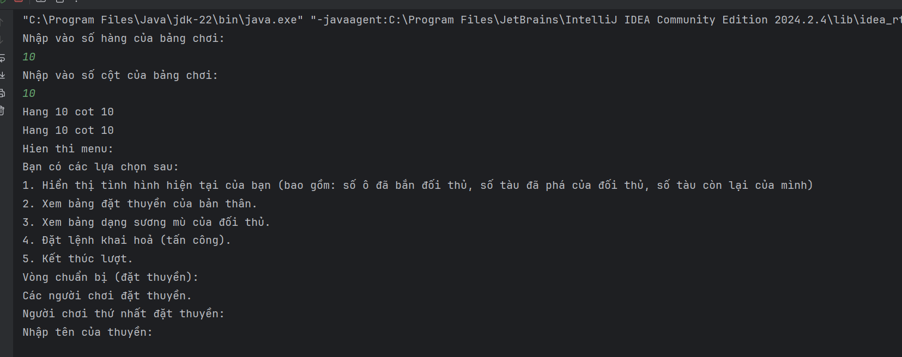
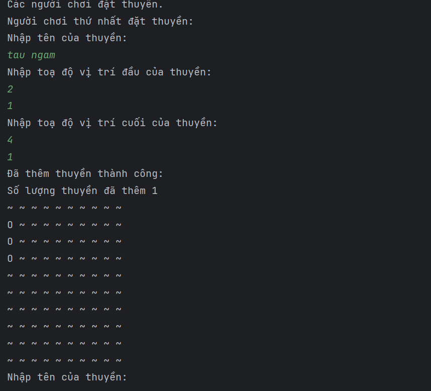

# Sea Battle

Sea Battle là một trò chơi dành cho hai người chơi. Trò chơi được chơi trên bốn lưới, hai cho mỗi người chơi. Các lưới thường là vuông - thường là 10 × 10 - và các ô riêng lẻ trong lưới được xác định bằng chữ cái và số. Trên một lưới, người chơi sắp xếp các tàu và ghi lại các phát bắn của đối thủ. Trên lưới còn lại, người chơi ghi lại các phát bắn của riêng mình.


### Cấu trúc folder

```bash

├── branch develop
│   ├── Văn Thị Mai Linh
│   │   ├── src
|   |   |   ├── main
|   |   |   |   ├── java
|   |   |   |   |   ├── controler
|   |   |   |   |   │   ├── Game.java
|   |   |   |   |   │   ├── Board.java
|   |   |   |   |   │   ├── Main.java
|   |   |   |   |   │   ├── Player.java
|   |   |   |   |   ├── model
|   |   |   |   |   │   ├── Menu.Java
|   |   |   |   |   │   ├── Ship.java

```

### Tổng quan trò chơi
- Là một người chơi, tôi có thể vào game và bắt đầu chơi. Sẽ có hai người chơi trong một ván game và lượt sẽ được luân phiên.

#### 📝 Vòng chuẩn bị
- Ban đầu, người chơi được cho 1 bảng 10x10, một cột đánh từ A->J, một cột đánh từ 1->10. Mỗi người chơi sở hữu 5 con thuyền như sau:
    - 2 Thuyền Tuần Tra (Patrol Boat) 1x2
    - 1 Tàu Khu Trục (Destroyer Boat) 1x4
    - 1 Tàu Ngầm (Submarine) 1x3
    - 1 Thiết Giáp Hạm (Battle Ship) 1x5


- Người chơi sẽ có thể nhập vào 2 toạ độ (X,Y) với từng mẫu thuyền để đặt thuyền, màn hình sẽ hiển thị thuyền lên bảng. Sau khi đặt xong hết, sẽ sang lượt đặt của người kia.
- Toạ độ thuyền đặt vào phải thoả mãn chưa có thuyền nào ở vị trí đó, và không nằm ngoài bảng chơi.

---
#### 📝 Trong Game
- Trong trò chơi, lượt của hai người chơi sẽ luân phiên nhau. Trong lượt của 1 người, anh có thể chọn các lựa chọn sau:
    - Khi hiển thị menu lựa chọn, hiển thị luôn tình hình hiện tại: gồm số ô đã bắn ở mặt trận địch, số tàu đã phá, số tàu còn lại của bản thân.
    - Xem bảng, cách đặt thuyền của bản thân (Nếu hai người cùng chơi trên 1 máy tính, lúc này anh sẽ tạm quay máy tính đi để xem cục diện hiện tại)
    - Người chơi có thể xem được bảng của đối phương ở dạng sương mù (tức là hiển thị những điểm nào đã bị bắn vào rồi, bao gồm điểm nào đã bắn vào nhưng không có gì, điểm nào đã bắn vào nhưng có một phần tàu ở đó, ...) các ô khác thì không hiển thị thông tin gì
    - Đặt lệnh khai hoả, có thể nhập 1 toạ độ X,Y để tiến hành khai hoả vào mặt trận đối phương, nếu trúng bất kì điểm nào của thuyền thì sẽ có thông báo trúng thuyền, còn không trúng thì thông báo đã trượt.
    - Kết thúc lượt ( khi người chơi hiện tại không muốn bắn hoặc bắn trượt thì yêu cầu chọn kết thúc lượt để người kia chơi).

---
#### 📝 Luật trò chơi
- 1 tàu sẽ bị phá huỷ chỉ sau khi toàn bộ điểm bị phá hết. ví dụ tàu 1x5 thì ít nhất 5 phát bắn trúng đích toàn bộ để phá
- Khi bên nào bị phá hết tàu trước lập tức thua cuộc và - hiển thị màn hình kết quả, bảng của cả 2 bên sau khi chơi.

#### 📝 Demo trò chơi


- Sau khi 2 bên đã đặt xong thuyền, thì người 1 bắt đầu chơi trước. Nếu người 1 bắn trượt thì đến người 2 chơi.


